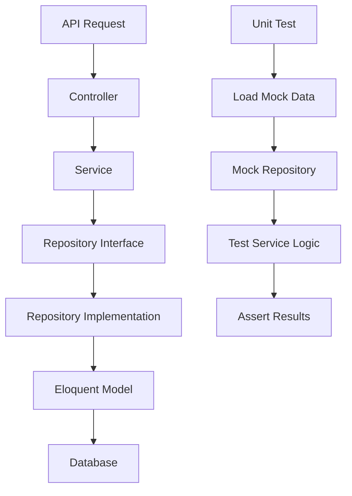

# Kiến trúc dự án Accounting System

## Tổng quan

Dự án sử dụng **Repository Pattern** với kiến trúc 3 tầng rõ ràng, đảm bảo code dễ test và maintain.

## Cấu trúc thư mục

```
example_unit_test/
├── app/
│   ├── Http/
│   │   └── Controllers/          # API Controllers (Presentation Layer)
│   ├── Models/                   # Eloquent Models (Data Layer)
│   ├── Repositories/             # Repository Layer
│   │   ├── Contracts/           # Repository Interfaces
│   │   └── *.php                # Repository Implementations
│   ├── Services/                # Business Logic Layer
│   └── Providers/               # Service Providers
├── database/
│   ├── migrations/              # Database migrations
│   └── seeders/                 # Database seeders
├── mockData/                    # Test data cho unit tests
│   ├── transactions.php
│   ├── categories.php
│   ├── accounts.php
│   └── reports.php
├── tests/
│   └── Unit/
│       └── Services/            # Unit tests cho services
└── routes/
    └── api.php                  # API routes
```

## Kiến trúc Repository Pattern

### 1. Repository Layer

**Contracts (Interfaces)**
- `BaseRepositoryInterface`: Interface cơ bản cho tất cả repositories
- `TransactionRepositoryInterface`: Interface cho Transaction repository
- `CategoryRepositoryInterface`: Interface cho Category repository  
- `AccountRepositoryInterface`: Interface cho Account repository

**Implementations**
- `BaseRepository`: Base implementation cho tất cả repositories
- `TransactionRepository`: Implementation cho Transaction operations
- `CategoryRepository`: Implementation cho Category operations
- `AccountRepository`: Implementation cho Account operations

### 2. Service Layer

Services chứa business logic và sử dụng repositories:

- `TransactionService`: Xử lý logic thu chi, tự động cập nhật số dư tài khoản
- `CategoryService`: Quản lý danh mục thu chi
- `AccountService`: Quản lý tài khoản tài chính
- `ReportService`: Tạo các báo cáo tài chính

### 3. Controller Layer

Controllers chỉ xử lý HTTP requests/responses và gọi Services:

- `TransactionController`: API endpoints cho transactions
- `CategoryController`: API endpoints cho categories
- `AccountController`: API endpoints cho accounts
- `ReportController`: API endpoints cho reports

## Dependency Injection Flow

```
Controller → Service → Repository → Model
```

**Ví dụ:**
```php
// Controller
TransactionController 
  ↓ (inject)
TransactionService
  ↓ (inject)  
TransactionRepository → Transaction Model
```

## Unit Testing Strategy

### Mock Data Structure

Tất cả test data được tổ chức trong `mockData/`:
- Mỗi tính năng có 1 file riêng
- Dữ liệu được nhóm theo test scenarios
- Dễ dàng maintain và reuse

### Testing Pattern

1. **Mock Repositories**: Sử dụng Mockery để mock repository interfaces
2. **Use Mock Data**: Load data từ `mockData/` files
3. **Test Business Logic**: Test logic trong Services, không test database

**Ví dụ:**
```php
public function test_create_transaction_success(): void
{
    // Load mock data
    $mockData = require __DIR__ . '/../../../mockData/transactions.php';
    
    // Mock repository
    $this->transactionRepository
        ->shouldReceive('create')
        ->andReturn($transaction);
    
    // Test service
    $result = $this->transactionService->createTransaction($mockData['valid_revenue_transaction']);
    
    // Assert
    $this->assertInstanceOf(Transaction::class, $result);
}
```

## Quy tắc thiết kế cho Unit Testing

1. **Dependency Injection**: Tất cả dependencies inject qua constructor
2. **Interface-based**: Sử dụng interfaces thay vì concrete classes
3. **Single Responsibility**: Mỗi class/method chỉ làm 1 việc
4. **No Static Methods**: Tránh static methods khó test
5. **Pure Functions**: Methods dễ test khi input/output rõ ràng

## Service Provider

`RepositoryServiceProvider` đăng ký bindings giữa interfaces và implementations:

```php
$this->app->bind(
    TransactionRepositoryInterface::class,
    TransactionRepository::class
);
```

Cho phép Laravel tự động inject implementations khi khởi tạo Services.

## Database Schema

### Accounts Table
- Quản lý các tài khoản tài chính (bank, cash, credit_card)
- Lưu số dư và thông tin tài khoản

### Categories Table
- Danh mục thu (revenue) và chi (expense)
- Phân loại các loại giao dịch

### Transactions Table
- Ghi nhận các giao dịch thu chi
- Liên kết với Account và Category
- Tự động cập nhật số dư Account khi tạo/sửa/xóa

## Workflow



## Tác giả

**Gin** <gin_vn@haldata.net>
